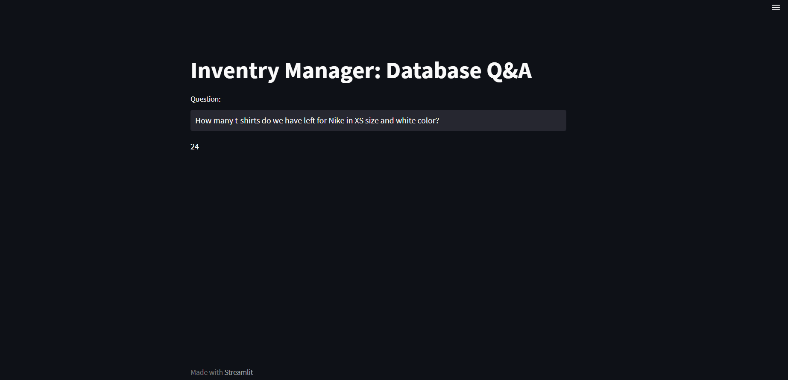

# Inventry-Manager

A modern **Inventory Management Bot** powered by **LLMs** and **LangChain**, connected to an SQL database. Leveraging natural language, this system dynamically generates SQL queries to retrieve inventory insights and answers. Built with Python and Streamlit for a seamless developer experience.

---

##  Table of Contents

- [Features](#features)  
- [Tech Stack](#tech-stack)  
- [Architecture](#architecture)  
- [Flowchart](#flowchart)  
- [Screenshots](#screenshots)  
- [Getting Started](#getting-started)  
  - [Prerequisites](#prerequisites)  
  - [Installation](#installation)  
  - [Configuration](#configuration)  
  - [Usage](#usage)  
- [Project Structure](#project-structure)  
- [Contributing](#contributing)  
- [License](#license)  
- [Contact](#contact)

---

##  Features

- **Natural Language Interaction**: Ask questions like “How many units of material X are available?”  
- **Automated SQL Generation**: LangChain interprets input, builds SQL queries, and executes them on your database.  
- **Few-Shot Prompting**: Improve accuracy by including examples in `few_shots.py`.  
- **Streamlit Interface**: A clean, intuitive UI—see `StreamLit_UI.png` in the repo.  
- **Interactive Notebook**: Explore core concepts and prototypes via `Inventry.ipynb`.

---

##  Tech Stack

- **Language**: Python  
- **LLM Framework**: LangChain  
- **Database**: SQL (SQLite/MySQL/PostgreSQL—configurable)  
- **UI**: Streamlit  
- **Prompting**: Few-shot examples via `few_shots.py`  
- **SQL Helpers**: `llm_helper.py` for generating queries, `main.py` orchestrates logic  

---

##  Architecture Overview

1. **User Input**: Enter a natural-language question in the Streamlit UI.  
2. **Prompt Processing**: The input is forwarded to `llm_helper.py` where LangChain generates an SQL query.  
3. **SQL Execution**: Executed against your connected SQL database.  
4. **Response**: Results returned and formatted back to the UI.

Core logic resides in:
- `main.py`: handles UI & flows  
- `llm_helper.py`: prompt & SQL generation  
- `few_shots.py`: sample pairs improving prompt fidelity  
- `Inventry.ipynb`: experimentation and prototyping  

---

##  Flowchart

```mermaid
flowchart TD
    A[User Input via Streamlit] --> B[LLM Processing with LangChain]
    B --> C[Generate SQL Query]
    C --> D[Execute Query on SQL Database]
    D --> E[Fetch Inventory Data]
    E --> F[Format Results]
    F --> G[Display Answer in Streamlit UI]

## Screenshots

Streamlit interface preview:


---

## Getting Started

### Prerequisites

* Python 3.8+
* Access to an SQL database (SQLite/MySQL/PostgreSQL)
* API key for your LLM provider (e.g., OpenAI, Gemini)

### Installation

```bash
git clone https://github.com/Atharv-M/Inventry-Manager.git
cd Inventry-Manager
pip install -r Requirement.txt
```

### Configuration

1. Set your environment variables (e.g., `export OPENAI_API_KEY="your_key_here"` or use `.env`).
2. Configure your database connection in `main.py` or `llm_helper.py` (update credentials, connection string, etc.).

### Usage

Run the Streamlit app:

```bash
streamlit run main.py
```

In the UI, type questions like:

* “What is the current stock level of \[Material Name]?”
* “List all materials with quantity below threshold.”
* “When was the last restock of \[Material]?”

The bot will interpret, generate SQL, execute, and display results.

---

## Project Structure

```
Inventry-Manager/
├── Inventry.ipynb       # Prototyping notebook
├── Requirement.txt      # Dependency list
├── StreamLit_UI.png     # UI screenshot
├── few_shots.py         # Prompt examples
├── llm_helper.py        # LLM and SQL generation logic
└── main.py              # Streamlit app entrypoint and flow
```

---

## Contributing

Contributions are welcomed! To submit improvements:

1. Fork the repository
2. Create a new feature branch: `git checkout -b feature/YourFeature`
3. Commit your changes and push to `origin`
4. Open a Pull Request explaining your enhancements

---

## License

This project is open-sourced under the **MIT License**.

---

## Contact

**Author**: Atharv M.
**GitHub**: [Atharv-M](https://github.com/Atharv-M)
Feel free to reach out for collaboration, feedback, or hiring discussions!

---

Thank you for checking out **Inventry-Manager**—where natural language meets real-time inventory intelligence.

```

---

⚡ This **Mermaid flowchart** will render directly on GitHub, showing a **step-by-step data flow** of your model.  

Do you want me to also add a **system architecture diagram (with UI, LLM, SQL DB as components)** in addition to this flowchart? That would make it even more recruiter-friendly.
```
